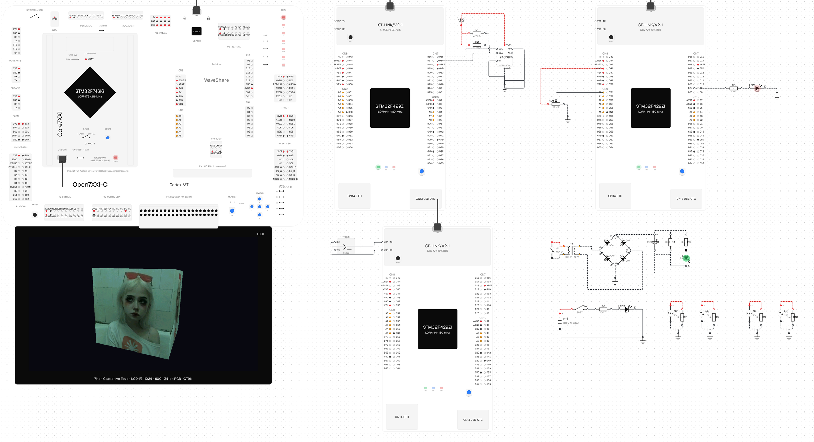

<p align="center">
  <picture>
    <source media="(prefers-color-scheme: dark)" srcset="docs/assets/logo-dark.svg">
    
  </picture>
</p>

<p align="center">
  A circuit simulator for microcontroller labs that runs your real STM32 firmware.<br>
  <a href="https://emul.digituni.org/"><b>emul.digituni.org</b></a>
</p>

<p align="center">
  <a href="https://emul.digituni.org/"></a>
  <a href="LICENSE"></a>
  
</p>

<a href="https://emul.digituni.org/"></a>

Drop the `.elf` from STM32CubeIDE onto a board, wire the parts, press Run. The firmware executes on
an emulated Cortex-M4/M7 while a nodal solver works out the bench around it: timers, UART, SPI,
I²C, DMA, ADC/DAC, sleep and wake-up, flash, an SDRAM-backed LTDC panel, all against real parts
with real ratings. Two boards on one net run in lockstep; a shorted output or 12 V on a GPIO does
what it does on the desk. A Monaco editor and a build service compile a project the way CubeIDE would.

```sh
pnpm install && pnpm dev     # http://localhost:5173
pnpm test                    # bench physics, batteries, wires, reflash
```

**Docs:** [what is modelled, and what is not](docs/coverage.md) · [architecture](docs/architecture.md) · [tests](docs/tests.md) · [roadmap](docs/plan.md)

Apache-2.0 · Copyright 2026 Bohdan Nahornyi, Denys Lysenok, Andrii Savenko · [third-party notices](THIRD_PARTY_NOTICES.md)
